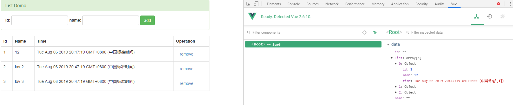

# Vue

## MVVM

> MVVM是前端视图层的分层开发思想，主要把每个页面分成M（页面数据），V（页面结构）和VM
>
> VM是MVVM思想的核心，是M和V之间的调度者
>
> 数据的**双向绑定**由VM提供

## Vue-demo

```html
............
<script src="https://cdn.jsdelivr.net/npm/vue"></script>

</head>
<body>
    <!-- V(View) -->
    <div id="app" class="container">
        <h3  class="text text-info">{{msg}}</h3>
    </div>
    
</body>
</html>

<script>
    // VM
    // 导入包后，浏览器内存中会有一个Vue构造器
    let vm = new Vue({
        el: '#app', // 表示当前new的Vue实例，控制的页面区域
        data: { // data属性中，存放的是el中用到的数据 ; M(Model)
            msg: 'Welcome to vue!' // 通过Vue指令，将数据渲染到页面
        }
    });
</script>
```

## 指令

### v-cloak

​	防止插值表达式闪烁；当资源引入防止最后，在还没渲染vue变量前，插值表达式会先显示，再被渲染值

在被渲染前，不显示

```html
	<style>
        [v-cloak]{
            display: none;
        }
    </style>

	<h3 v-cloak class="text text-info">{{msg}}</h3>
```

### v-text

​	不会有闪烁问题；v-text会覆盖元素中原始值`<h4 v-text="msg"></h4>`

### v-html

​	将html内容转义 ` <div v-html="msg1"></div>`

### v-bind

​	用于属性绑定，修改绑定属性值，`v-bind:`可以简写为`:`

`<input type="button" class="btn btn-danger" v-bind:value="msg2" :title="msg2 + ' test value'" >`

​	`v-bind`中可以写合法的JS

`<input type="text" class="form-control" :value="navigator.userAgent">`

### v-on

​	事件绑定机制，对触发的事件进行绑定；`v-on:`简写为`@`

`<input type="button" class="btn btn-info" value="v-on:click" v-on:click="show">`

```javascript
let vm = new Vue({
        el: '#app',
    	........................
        methods: {  // 这个methods属性中定义了当前Vue实例所有可用的方法
            show: ()=>{
                alert('v-on:click');
            }
        },
    });
```

#### 事件修饰符

- stop : 阻止冒泡
- prevent ：阻止默认事件
- capture ：添加事件监听器时使用事件捕获模式
- self：只有事件在该元素本身触发时触发回调
- once：事件只触发一次

```html
<!-- .stop 阻止冒泡 -->
        <div class="inner" @click="divHandler">

            <input type="button" class="btn btn-warning" value="button" @click.stop="btnHandler">

        </div>
        <!--  -->
        
        <hr>
        <!-- .prevent 阻止默认行为 -->
        <a href="http://www.baidu.com" class="btn btn-link" @click.prevent="linkClick">baidu Link</a>

        <!-- .capture  实现捕获触发事件的机制，先触发外部的相同事件-->
        <div class="inner" @click.capture="divHandler">

            <input type="button" class="btn btn-warning" value="button" @click="btnHandler">

        </div>
        <!-- .self 只有点击当前元素，才能触发事件处理函数 -->
        <div class="inner" @click.self="divHandler">

            <input type="button" class="btn btn-warning" value="button" @click="btnHandler">

        </div>

         <!-- .once 只触发一次事件处理函数 -->
         <a href="http://www.baidu.com" class="btn btn-link" @click.prevent.once="linkClick">baidu Link</a>

```

```javascript
 		   divHandler(){
                console.log('触发inner div 点击事件');
                
            },
            btnHandler(){
                console.log('触发 btn input 点击事件');
            },
            linkClick(){
                console.log('触发 link a 点击事件')
            }
```

### v-model

​	数据的双向数据绑定

```html
<h4>{{msg}}</h4>
<!-- v-model 可以实现 表单元素和Model中数据的双向数据绑定 -->
<!-- v-model 只能应用在 表单元素中 -->
<input type="text" class="form-control" v-model="msg">
```

### v-for

#### 基本使用

```html
		<p class="text text-success">迭代简单数组</p>
            <ul>
                <li v-for="(item, i) in list">
                    index: {{i}} , value: {{item}}
                </li>
            </ul>
            <p class="text text-success">迭代对象数组</p>
            <ul>
                <li v-for="(item, i) in list1">
                    index: {{i}} , id: {{item.id}} , name: {{item.name}}
                </li>
            </ul>
            <p class="text text-success">迭代对象key-value</p>
            <ul>
                <li v-for="(val, key,  i) in user">
                    index: {{i}} , key: {{key}} , val: {{val}}
                </li>
            </ul>
            <p class="text text-success">迭代数字</p>
            <ul>
                <li v-for="count in 10">
                    count: {{count}}
                </li>
            </ul>
```

#### 与key配置使用

```html
<p class="text text-success">v-for 与 key 使用</p>
            <div class="panel panel-success">

                <div class="panel-body form-inline">
                    <label for="">id:</label>
                    <input type="text" class="form-control" v-model="id">
                    <label for="">name:</label>
                    <input type="text" class="form-control" v-model="name">

                    <input type="button" class="btn btn-success" value="add" @click="add">

                </div>
                <!-- key使用时，必须使用v-bind -->
                <!-- 在组件中，使用v-for循环时，或在一些特殊情况时，v-for有问题，必须使用key -->
                <!-- 如： 该例，选中某一项，以push从结尾添加对象时，没问题，但使用unshift从头添加时，即选中的项错位 -->
                <p v-for="item in list1" :key="item.id">

                    <input class="" type="checkbox">{{item.id}} : {{item.name}}
                </p>

            </div>
```

```javascript
		list: [1, 2, 3, 4, 5],
            list1: [{
                    id: 1,
                    name: 'lov-1'
                },
                {
                    id: 2,
                    name: 'lov-2'
                },
                {
                    id: 3,
                    name: 'lov-3'
                },
            ],
            user: {
                id: 1,
                name: 'lov',
                gender: 'man'
            },
            id: '',
            name: '',
                
       ........................
            
       add() {
                // this.list1.push({id: this.id, name: this.name});
                this.list1.unshift({id: this.id, name: this.name});
            }
```

### v-if / v-show

v-if：每次会重新删除和创建元素，有较高的切换性能消耗

v-show： 与v-if不同，只是切换`display:none`样式， 有较高的初始渲染消耗

```html
<input class="btn btn-success" type="button" value="toggle" @click="flag=!flag">
               	<h3 v-if="flag">v-if test</h3>
                <h3 v-show="flag">v-show test</h3>
```

```javascript
 flag: true,
```

## 样式使用

#### 使用class样式

- 数组：` <h4 :class="['label','label-info']">class test</h4>`

- 数组中三元表达式：`<h4 :class="['label',isInfo?'label-info':'label-warning']">class test</h4>`

- 数组中嵌套对象：`<h4 :class="['label',{'label-danger':!isInfo}]">class test</h4>`

- 直接使用对象：`<h4 :class="{ 'label': true, 'label-primary': true}">class test</h4>` , `<h4 :class="classObj">class test</h4>`

  ```html
  <div class="alert alert-success">
  	<strong>样式使用</strong>
  </div>
  <div class="well">
  	<h4 :class="['label','label-info']">class test</h4>
  	<h4 :class="['label',isInfo?'label-info':'label-warning']">class test</h4>
  	<h4 :class="['label',{'label-danger':!isInfo}]">class test</h4>
  	<h4 :class="{ 'label': true, 'label-primary': true}">class test</h4>
  	<h4 :class="classObj">class test</h4>
  </div>
  ```

  ```javascript
   let vm = new Vue({
          el: '#app',
          data: { 
              isInfo: false,
              classObj: { 'label': true, 'label-default': true},
              ...............
  ```

#### 使用内联样式

- 直接在元素上通过`:style`的形式写样式

- 将样式对象定义到`data`中，引用到`:style`中

- 在`:style`中通过数组，引入多个`data`上的样式对象

  ```html
  <h3 :style="{'color': 'red' ,'font-size': '15px'}">style test</h3>
  <h3 :style="styleObj">style test</h3>
  <h3 :style="[styleObj,styleObj1]">style test</h3>
  ```

  ```javascript
  let vm = new Vue({
          el: '#app', 
          data: {            
              styleObj: {'color': 'green' ,'font-size': '20px'},
              styleObj1: {'background-color':'skyblue'},
              ..............
  ```


## 过滤器

​	Vue允许自定义过滤器，可被用作一些常见的文本格式化。

​	过滤器可以用在两个地方：mustache插值 和 v-bind表达式

​	过滤器该被添加在javascript 表达式的尾部，由“管道”符指示

```html
<div class="alert alert-success">
	<h3>过滤器</h3>
</div>
<div class="well">
	<h4>{{msg1 | msgFormat('标签体') | test }}</h4>
</div>
```

```javascript
 // 定义一个Vue 全局的过滤器
    Vue.filter('msgFormat',(msg, arg)=>{
        return msg.replace(/<.*?>/g, arg);
    })
    Vue.filter('test',(msg)=>{
        return msg + '======';
    })


// 私有过滤器, 私有与全局同名，调用私有
 let vm = new Vue({
     ......
     filters: {
            msgFormat: (msg, arg)=>{
                return msg + '  private filters';
            }
        },
    });
```


## demo

走马灯效果： [./vue-demo/vue-02.html](走马灯效果)

简易计算器： [./vue-demo/vue-03.html](简易计算器)

列表案例：[./vue-demo/vue-04.html](列表案例)

## tools

Vue.js devtools

download： http://chromecj.com/web-development/2018-01/886/download.html

detail：http://chromecj.com/utilities/2018-12/1653.html

使用该插件，不能引入压缩的vue




